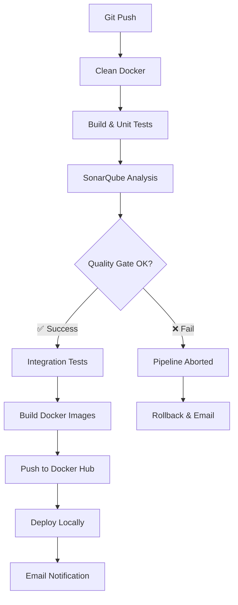

# 🛡️ Safe-Zone - Code Quality & SonarQube Integration Platform

<div align="center">


**Plateforme e-commerce microservices axée sur la qualité du code et l'intégration continue avec SonarQube**

[Architecture](#-architecture) • [SonarQube Integration](#-intégration-sonarqube) • [Quality Gates](#-quality-gates) • [Getting Started](#-démarrage-rapide)

</div>

---

## 📋 À propos du projet

**Safe-Zone** est un projet d'apprentissage DevOps centré sur la **maîtrise de SonarQube** et son intégration dans le cycle de développement. Ce projet démontre les meilleures pratiques d'analyse de qualité du code, de couverture de tests et de gestion des quality gates dans un environnement microservices moderne.

### 🎯 Objectifs Pédagogiques

- ✅ **Maîtriser SonarQube** : Configuration, intégration et utilisation avancée
- ✅ **Analyse de Code Statique** : Détection automatique des bugs, vulnérabilités et code smells
- ✅ **Couverture de Code** : Intégration JaCoCo pour le tracking de la couverture de tests
- ✅ **Quality Gates** : Mise en place de portes qualité strictes dans le pipeline CI/CD
- ✅ **Reporting Qualité** : Génération automatique de rapports de qualité par microservice
- ✅ **Intégration Continue** : Pipeline Jenkins avec blocage sur échec des quality gates

---

## 🏗️ Architecture

### Microservices Backend (Spring Boot)

```
┌─────────────────────────────────────────────────────────────┐
│                   API Gateway (8080)                         │
│              + Spring Cloud Gateway                          │
└────────────────────┬────────────────────────────────────────┘
                     │
        ┌────────────┼────────────┬────────────┐
        │            │            │            │
   ┌────▼───┐   ┌───▼────┐  ┌───▼────┐  ┌────▼─────┐
   │ User   │   │ Order  │  │ Media  │  │Discovery │
   │Service │   │Service │  │Service │  │ Server   │
   │ (8081) │   │ (8084) │  │ (8083) │  │  (8761)  │
   └────────┘   └────────┘  └────────┘  └──────────┘
                                              │
                                         ┌────▼────┐
                                         │ Config  │
                                         │ Service │
                                         │ (8888)  │
                                         └─────────┘
```

### Frontend (Angular/TypeScript)
- **Application SPA** moderne avec TypeScript
- **Interface utilisateur** responsive
- **Nginx reverse proxy** avec SSL/TLS

---

## 🛠️ Stack Technologique

### Backend & Qualité

| Technologie | Version | Usage |
|-------------|---------|-------|
|  | 21 | Language backend |
|  | 3.5.4 | Framework microservices |
|  | 2025.0.0 | Service mesh |
|  | 3.9+ | Build automation |

### Frontend

| Technologie | Proportion | Usage |
|-------------|-----------|-------|
|  | 32.6% | Language frontend |
|  | 14.7% | Structure |
|  | 21.5% | Styles |
|  | - | Framework SPA |

### 🎯 Outils Qualité & DevOps (Focus Principal)

| Outil | Version | Rôle |
|-------|---------|------|
|  | Latest | **Analyse qualité code** |
|  | 0.8.12 | **Couverture de code** |
|  | - | **CI/CD avec Quality Gates** |
|  | - | Containerisation |
|  | 5 | Tests unitaires |
|  | - | Base de données |

---

## 🔬 Intégration SonarQube

### Configuration Maven avec SonarQube

Chaque microservice est configuré avec les plugins nécessaires :

```xml
<!-- pom.xml - Exemple pour user-service -->
<dependencies>
    <!-- SonarQube Plugin API -->
    <dependency>
        <groupId>org.sonarsource.sonarqube</groupId>
        <artifactId>sonar-plugin-api</artifactId>
        <version>9.3.0.51899</version>
    </dependency>
    
    <!-- JaCoCo pour la couverture -->
    <dependency>
        <groupId>org.jacoco</groupId>
        <artifactId>jacoco-maven-plugin</artifactId>
        <version>0.8.13</version>
    </dependency>
</dependencies>

<build>
    <plugins>
        <!-- JaCoCo Agent -->
        <plugin>
            <groupId>org.jacoco</groupId>
            <artifactId>jacoco-maven-plugin</artifactId>
            <version>0.8.12</version>
            <executions>
                <execution>
                    <goals>
                        <goal>prepare-agent</goal>
                    </goals>
                </execution>
                <execution>
                    <id>report</id>
                    <phase>verify</phase>
                    <goals>
                        <goal>report</goal>
                    </goals>
                </execution>
            </executions>
        </plugin>
        
        <!-- SonarQube Scanner -->
        <plugin>
            <groupId>org.sonarsource.scanner.maven</groupId>
            <artifactId>sonar-maven-plugin</artifactId>
            <version>3.9.1.2184</version>
        </plugin>
    </plugins>
</build>
```

### Commande d'Analyse SonarQube

```bash
mvn clean verify -DskipTests=false sonar:sonar \
  -Dsonar.projectKey=sonar-user \
  -Dsonar.host.url=http://localhost:9000 \
  -Dsonar.token=$SONAR_USER_TOKEN \
  -Dsonar.coverage.jacoco.xmlReportPaths=target/site/jacoco/jacoco.xml
```

### Projets SonarQube par Microservice

| Microservice | Project Key | Analyse |
|--------------|-------------|---------|
| Discovery Service | `sonar-discovery` | ✅ Bugs, Vulnerabilities, Code Smells |
| Config Service | `sonar-config` | ✅ Bugs, Vulnerabilities, Code Smells |
| API Gateway | `sonar-api-gateway` | ✅ Bugs, Vulnerabilities, Code Smells |
| User Service | `sonar-user` | ✅ + Code Coverage (JaCoCo) |
| Order Service | `sonar-order` | ✅ + Code Coverage (JaCoCo) |
| Media Service | `sonar-media` | ✅ + Code Coverage (JaCoCo) |

---

## 🚦 Quality Gates

### Pipeline avec Quality Gate Strict

Le pipeline Jenkins intègre un **Quality Gate bloquant** :

```groovy
stage('Build & Unit Test') {
    steps {
        withSonarQubeEnv('safe-zone-mr-jenk') {
            withCredentials([string(credentialsId: 'SONAR_USER_TOKEN', variable: 'SONAR_USER_TOKEN')]) {
                sh '''
                    cd user-service
                    mvn clean verify -DskipTests=false sonar:sonar \
                        -Dsonar.projectKey=sonar-user \
                        -Dsonar.host.url=$SONAR_HOST_URL \
                        -Dsonar.token=$SONAR_USER_TOKEN \
                        -Dsonar.coverage.jacoco.xmlReportPaths=target/site/jacoco/jacoco.xml
                '''
            }
        }
    }
}

stage('Sonar Quality Gate') {
    steps {
        timeout(time: 25, unit: 'MINUTES') {
            waitForQualityGate abortPipeline: true // ⚠️ Bloque si échec
        }
    }
}
```

### Métriques Analysées

- 🐛 **Bugs** : Détection automatique d'erreurs potentielles
- 🔒 **Vulnerabilities** : Analyse de sécurité du code
- 💡 **Code Smells** : Problèmes de maintenabilité
- 📊 **Code Coverage** : Taux de couverture des tests (JaCoCo)
- 🔄 **Duplications** : Détection de code dupliqué
- 📏 **Technical Debt** : Estimation du coût de la dette technique

---

## 🔄 Pipeline CI/CD Complet



### Étapes du Pipeline

#### 1️⃣ **Clean Docker**
```bash
docker system prune -af
```

#### 2️⃣ **Build & Unit Tests + SonarQube**
- Build Maven pour chaque microservice
- Exécution des tests unitaires (JUnit)
- **Analyse SonarQube complète**
- Génération des rapports JaCoCo

#### 3️⃣ **Quality Gate Validation** ⭐
```groovy
waitForQualityGate abortPipeline: true
```
- ⏰ Timeout de 25 minutes
- 🚫 **Blocage automatique si le Quality Gate échoue**
- 📧 Notification email en cas d'échec

#### 4️⃣ **Integration Tests**
- Lancement de l'environnement complet avec Docker Compose
- Tests inter-services
- Nettoyage automatique

#### 5️⃣ **Deploy**
- Build des images Docker
- Push vers Docker Hub avec versioning
- Déploiement local automatique

#### 6️⃣ **Post-Actions**
- ✅ **Success** : Sauvegarde du numéro de build + Email de confirmation
- ❌ **Failure** : Rollback automatique vers la dernière version stable + Email d'alerte

---

## 🚀 Démarrage Rapide

### Prérequis

- **Docker** & Docker Compose
- **Java 21+**
- **Maven 3.9+**
- **Node.js 20+** (pour le frontend)
- **SonarQube** (Docker ou instance existante)

### 1. Démarrer SonarQube

```bash
# Avec volumes persistants
docker run -d --name sonarqube \
  -p 9000:9000 \
  -v sonarqube_data:/opt/sonarqube/data \
  -v sonarqube_extensions:/opt/sonarqube/extensions \
  -v sonarqube_logs:/opt/sonarqube/logs \
  sonarqube:latest
```

Accéder à SonarQube : `http://localhost:9000`
- Credentials par défaut : `admin/admin`

### 2. Configurer les Tokens SonarQube

1. Se connecter à SonarQube
2. Aller dans **My Account > Security**
3. Générer un token d'authentification
4. Configurer les credentials Jenkins :
   - `SONAR_USER_TOKEN`
   - SonarQube server : `safe-zone-mr-jenk`

### 3. Cloner et Configurer le Projet

```bash
# Cloner le repository
git clone https://github.com/mamadbah2/safe-zone.git
cd safe-zone

# Configurer les variables d'environnement
export GITHUB_TOKEN=your_github_token
export SONAR_USER_TOKEN=your_sonar_token
```

### 4. Lancer l'Application

```bash
# Option 1 : Avec Docker Compose
docker-compose up --build

# Option 2 : Build local avec analyse SonarQube
cd user-service
mvn clean verify sonar:sonar \
  -Dsonar.projectKey=sonar-user \
  -Dsonar.host.url=http://localhost:9000 \
  -Dsonar.token=$SONAR_USER_TOKEN
```

### 5. Accéder aux Services

| Service | URL | Description |
|---------|-----|-------------|
| Frontend | `http://localhost` | Interface utilisateur |
| API Gateway | `http://localhost:8080` | Point d'entrée API |
| Eureka Dashboard | `http://localhost:8761` | Service discovery |
| Config Server | `http://localhost:8888` | Configuration centralisée |
| **SonarQube** | `http://localhost:9000` | **Dashboard qualité** |

---

## 📊 Rapports de Qualité

### Visualisation dans SonarQube

Après chaque build, consultez les dashboards SonarQube :

```
http://localhost:9000/dashboard?id=sonar-user
http://localhost:9000/dashboard?id=sonar-order
http://localhost:9000/dashboard?id=sonar-media
```

### Métriques Clés à Surveiller

- **Reliability Rating** : A à E (bugs)
- **Security Rating** : A à E (vulnérabilités)
- **Maintainability Rating** : A à E (code smells)
- **Coverage** : Pourcentage de code couvert par les tests
- **Duplications** : Pourcentage de lignes dupliquées
- **Technical Debt** : Temps estimé pour corriger tous les problèmes

---

## 🔧 Configuration Jenkins

### Credentials Requis

```groovy
credentials {
    'docker-hub-credentials'  // Docker Hub user + token
    'dockerhub-credential'    // Docker Hub authentication
    'GITHUB_TOKEN'            // GitHub personal access token
    'SONAR_USER_TOKEN'        // SonarQube authentication token
}
```

### SonarQube Server Configuration

Dans Jenkins : **Manage Jenkins > Configure System > SonarQube servers**

```
Name: safe-zone-mr-jenk
Server URL: http://localhost:9000
Server authentication token: [SONAR_USER_TOKEN]
```

### Webhook SonarQube (Quality Gate)

Dans SonarQube : **Administration > Configuration > Webhooks**

```
Name: Jenkins
URL: http://jenkins-server:8080/sonarqube-webhook/
```

---

## 🎓 Apprentissages Clés

### ✅ Ce que ce projet démontre

1. **Configuration SonarQube dans un projet multi-modules**
2. **Intégration JaCoCo pour la couverture de code**
3. **Quality Gates automatiques dans le pipeline CI/CD**
4. **Analyse différenciée par microservice**
5. **Blocage du pipeline en cas de non-respect des standards**
6. **Génération automatique de rapports de qualité**
7. **Gestion de la dette technique**

### 📚 Compétences DevOps Acquises

- ✅ **SonarQube** : Installation, configuration, quality gates
- ✅ **Analyse Statique** : Détection de bugs et vulnérabilités
- ✅ **Code Coverage** : JaCoCo, reporting, seuils
- ✅ **Pipeline CI/CD** : Intégration qualité dans le workflow
- ✅ **Jenkins** : Configuration avancée avec SonarQube
- ✅ **Best Practices** : Standards de code, maintenabilité

---

## 📧 Notifications Email

Le pipeline envoie des emails automatiques :

```groovy
post {
    success {
        mail to: 'bahmamadoubobosewa@gmail.com',
             subject: "SUCCESS: Pipeline ${env.JOB_NAME} [${env.BUILD_NUMBER}]",
             body: "✅ Quality Gate passed. See details: ${env.BUILD_URL}"
    }
    failure {
        mail to: 'bahmamadoubobosewa@gmail.com',
             subject: "FAILURE: Pipeline ${env.JOB_NAME} [${env.BUILD_NUMBER}]",
             body: "❌ Quality Gate failed or build error. See logs: ${env.BUILD_URL}"
    }
}
```

---

## 🔄 Rollback Automatique

En cas d'échec du pipeline (including Quality Gate), rollback automatique :

```groovy
failure {
    script {
        def lastSuccessfulBuild = sh(script: "cat last_successful_build.txt", returnStdout: true).trim()
        
        if (lastSuccessfulBuild) {
            echo "🔄 Rollback vers la version ${lastSuccessfulBuild}..."
            withEnv(["IMAGE_VERSION=${lastSuccessfulBuild}"]) {
                sh "docker-compose -f docker-compose-deploy.yml pull"
                sh "docker-compose -f docker-compose-deploy.yml up -d"
            }
        }
    }
}
```

---

## 🤝 Contribution

Ce projet est un exercice d'apprentissage axé sur **SonarQube et la qualité du code**. Les contributions sont les bienvenues !

1. Fork le projet
2. Créer une branche feature (`git checkout -b feature/quality-improvement`)
3. Commit (`git commit -m 'Improve code quality'`)
4. Push (`git push origin feature/quality-improvement`)
5. Ouvrir une Pull Request

---

## 📫 Contact

**Mamadou Bah** - [@mamadbah2](https://github.com/mamadbah2)

📧 Email : bahmamadoubobosewa@gmail.com

Project Link: [https://github.com/mamadbah2/safe-zone](https://github.com/mamadbah2/safe-zone)

---

<div align="center">

**⭐ Si ce projet vous a aidé à apprendre SonarQube et l'analyse de qualité de code, n'hésitez pas à mettre une étoile ! ⭐**


</div>
